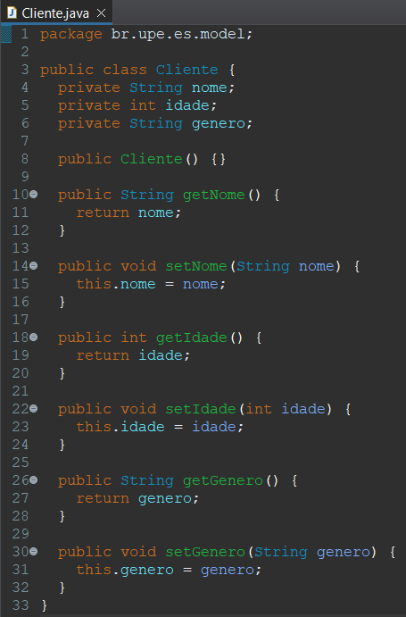
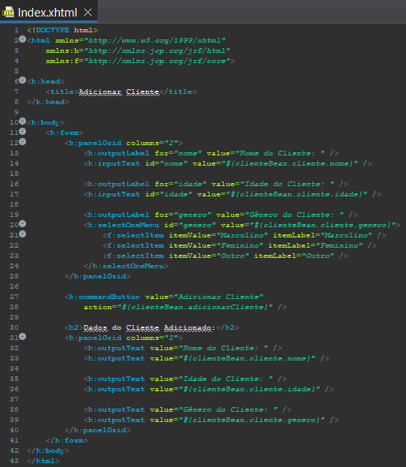

Template para Seminário sobre a tecnologia jsf
# Guia Detalhado para Seminário de `JSF`

Este guia serve como um roteiro detalhado para alunos que estão preparando um seminário técnico e aprofundado sobre `JSF`, com foco na arquitetura e implementação.

# Seção 1: Introdução ao JSF

- Nesta seção, vocês devem abordar o que é `JSF`, por que ele é uma escolha popular entre os desenvolvedores, e como iniciar projetos usando este framework. 
- O objetivo é fornecer aos colegas que estão assitindo a apresentação uma visão geral com base sólida sobre o que vocês pesquisaram sobre o `JSF`.
- Descrevam como o JSF se posiciona entre outros frameworks e bibliotecas, como `Spring MVC` e `Struts`, em termos de curva de aprendizado, performance e uso.

## 1.1 O que é JSF?

O `JSF` (Jakarta Faces, atualmente) foi desenvolvido pela Sun Microsystems (agora adquirida pela Oracle Corporation) como parte da plataforma Java EE (Enterprise Edition). No momento em que foi criado, sua função foi tentar resolver problemas como a complexidade de desenvolvimento, gerenciamento de estado, reusabilidade de componentes e integração com outras tecnologias Java. É importante destacar que este framework se baseia no padrão MVC, e que dentre suas principais características, é importante destacar o uso de componentes. Nele, já vem uma lista de componentes que podem ser utilizados, porém também podem ser usadas algumas bibliotecas que contêm mais componentes, como o PrimeFaces.

Apesar de ainda ser utilizado em  projetos específicos e mais ainda em sistemas legado, ele era mais utilizado até o meio da década de 2010, que foi justamente quando começou a perder espaço para frameworks mais modernos e progressivos, como `React.js`, `VUE`, entre outros.

Junto com o `Spring MVC` e `Struts`, ele é baseado em Java. Enquanto o `Spring` tem uma estrutura mais completa, contando com com as funcionalidades necessárias para atender requisições HTTP, delegar responsabilidades de processamento de dados para outros componentes e preparar a resposta que precisa ser dada, o `JSF` se baseia em um modelo um pouco mais complexo. Como será explicado depois, seu ciclo de vida conta com bem mais passos, que são, de certa forma, “mascarados” no `Spring MVC`. 

Enquanto o `Struts` é um framework MVC mais tradicional baseado em configuração XML e tags JSP, o `JSF` é um framework MVC baseado em componentes com uma abordagem mais moderna e orientada a eventos. A escolha entre `Struts` e `JSF` geralmente depende das preferências da equipe de desenvolvimento, dos requisitos do projeto e da infraestrutura tecnológica existente.

- Qual a diferença entre o `JSF` e um framework mais progressivo `React.js`?

Em relação a arquitetura, é importante destacar que, enquanto o `JSF` é baseado no MVC e componentizado e utiliza a renderização no lado do servidor, o React usa a renderização no lado do cliente, além de que o `JSF` gerencia o estado usando a sessão do servidor e a árvore de componentes, enquanto o React usa um DOM virtual e um fluxo de dados unidirecional para lidar com o gerenciamento de estado. O DOM virtual do React permite atualizações eficientes e melhor desempenho ao lidar com interações complexas de UI e mudanças de estado.

Além disso, o framework `JSF` é não reativo, ao contrário da maioria dos frameworks webs mais utilizados, enquanto frameworks reativos como o `VUE` atuam utilizando a assincronia, e tendo como base conceitos como a responsividade (A  capacidade de oferecer um feedback mais rápido), resiliência(A capacidade de reagir e se recuperar de falhas) e elasticidade(A capacidade de se manter responsivo e resiliente, mesmo com altas variações de carga). 

Dito isso, em relação à outros frameworks mais progressivos, e suas principais características, é importante destacar pontos cruciais como a curva de aprendizado: onde `JSF` tende a ter mais íngreme em comparação com React e Angular, especialmente para desenvolvedores que não estão familiarizados com o ecossistema Java EE, e a performance: onde em termos de performance, `JSF` pode ser considerado relativamente eficiente. No entanto, em comparação com React e Angular, `JSF` pode ser menos eficiente em termos de renderização de interfaces de usuário altamente dinâmicas e interativas.

## 1.2 Por que JSF?

O JavaServer Faces (JSF) ganhou popularidade principalmente devido à sua integração com o ecossistema Java EE e sua abordagem baseada em componentes para o desenvolvimento de interfaces de usuário web.

O `JSF` é ideal para aplicações empresariais devido à sua escalabilidade e integração com tecnologias Java EE como EJB e JPA, permitindo o desenvolvimento de sistemas robustos. Sua capacidade de gerenciamento de estado é vantajosa para sistemas corporativos complexos, e sua integração com APIs de segurança oferece um alto nível de proteção. Ele também é adequado para e-commerce devido aos seus componentes ricos de UI e facilidade de integração com sistemas de pagamento. Em resumo, o `JSF` é uma escolha popular para projetos que exigem uma UI complexa, requisitos de segurança elevados e escalabilidade.

É importante notar que o cenário de desenvolvimento web está em constante evolução, e outras tecnologias, como `Angular`, `React` e `Vue.js`, ganharam popularidade nos últimos anos. Dependendo dos requisitos do projeto, pode ser vantajoso considerar essas tecnologias alternativas ao JSF, principalmente devido a experiência do usuário e o desempenho.

### 1.2.1 **Comparação JSF, Vue e React**

- **Tamanho do Framework:**

**JSF:** Pode variar dependendo da implementação específica e das bibliotecas adicionais utilizadas em um projeto. No entanto, em termos de tamanho de arquivo para download, o próprio `JSF` é relativamente pequeno, geralmente medido em megabytes.

**Vue:** A versão completa do `Vue.js`, incluindo o runtime e todas as funcionalidades, tem cerca de 80KB, devido ao seu tamanho de biblioteca menor e modularidade.

**React:** É conhecido por ser leve, especialmente quando usado com abordagens como `React` com JSX e componentes funcionais. Sua biblioteca se aproxima muito do tamanho do `Vue.js`, com 100KB, o que ajuda em alta performance durante a execução.

- **Velocidade:**

**JSF:** Pode ser mais lento em termos de velocidade de carregamento e renderização, especialmente em comparação com `Vue` e `React`, devido à complexidade do ciclo de vida e à comunicação com o back-end.

**Vue:** É geralmente mais rápido devido à sua abordagem eficiente de renderização com Virtual DOM.

**React:** É conhecido por sua eficiência de renderização, especialmente devido ao seu Virtual DOM e algoritmo de reconciliação.

- **Flexibilidade:**

**JSF:** É altamente integrado ao ecossistema Java EE, o que pode limitar sua flexibilidade para projetos fora desse contexto.

**Vue:** Oferece mais flexibilidade, permitindo uma variedade de abordagens de desenvolvimento e fácil integração com outras bibliotecas JavaScript.

**React:** Se diferencia pela sua abordagem inovadora de construção de interfaces de usuário, que se baseia em um modelo de componente reutilizável e declarativo, oferecendo assim uma experiência de desenvolvimento altamente flexível e escalável.

- **Curva de aprendizado:**

**JSF:** Pode ser íngreme para iniciantes devido à sua complexidade e conceitos específicos do Java EE.

**Vue:** É conhecido por ter uma curva de aprendizado mais suave, especialmente para desenvolvedores que já estão familiarizados com HTML, CSS e JavaScript.

**React:** Pode ser moderada, especialmente para aqueles familiarizados com JavaScript e programação funcional.

- **Integração com AJAX:**

**JSF:** Possui suporte nativo para AJAX através do componente f:ajax, tornando a integração com chamadas assíncronas relativamente fácil.

**Vue:** Não possui uma solução nativa para chamadas AJAX, mas é frequentemente usado em conjunto com bibliotecas como Axios para lidar com requisições assíncronas.

**React:** Embora não tenha uma solução embutida para chamadas AJAX, o React oferece uma integração fluida com bibliotecas populares como Axios.

- **Suporte a Facelets:**

**JSF:** Possui suporte nativo para Facelets, uma tecnologia de templating poderosa e flexível, facilitando a criação de interfaces de usuário.

**Vue:** Não é integrado diretamente com Facelets, mas pode ser usado em conjunto com ele, onde oferece uma integração fluida, permitindo o desenvolvimento de interfaces de usuário interativas e responsivas.

**React:** Não possui uma integração direta com Facelets, mas pode ser facilmente usado em conjunto, especialmente em ambientes onde a separação entre front-end e back-end é uma prática comum.
  
## 1.3 Primeiros Passos com JSF

- **IDE Recomendada:** Eclipse IDE

- **Configurações Iniciais com Eclipse e Tomcat:** 

[](https://www.youtube.com/watch?v=769ZnyHNB8k)

- **Estrutura do projeto:** 


Em `src/main/java`, criamos um pacote onde podemos colocar a classe e seu respectivo bean juntos. Quanto à página HTML, ela deve ser colocada diretamente em `src/main/webapp`. Os arquivos XML de configuração são armazenados dentro de `src/main/webapp/WEB-INF`, assim como qualquer arquivo.jar adicional necessário para o projeto, que é colocado em `src/main/webapp/WEB-INF/lib`.

## 1.4 Primeiro Componente JSF






Primeiro é criado o xhtml com o componente de `h:inputText` para receber o valor do nome e da idade do cliente.

Agora criamos a classe ClienteBean, que é um managed bean definido com a anotação @ManagedBean. Ele possui uma propriedade cliente do tipo Cliente, que representa os dados do cliente. Além disso, ele possui um método adicionarCliente() que será chamado quando o botão "Adicionar Cliente" for clicado. 

Então, quando são preenchidos os campos no formulário HTML e o botão "Adicionar Cliente" é clicado, o JSF atualiza as propriedades do managed bean ClienteBean com os valores inseridos pelo usuário. Em seguida, ele chama o método adicionarCliente() no bean ClienteBean, onde são processados os dados do cliente. O resultado é refletido no próprio XHTML, onde os valores são exibidos utilizando expressões (#{clienteBean.cliente.nome}; #{clienteBean.cliente.idade} e #{clienteBean.cliente.genero}).

Também adicionamos o componente `h:selectOneMenu` para a seleção do genêro do cliente.

O `h:commandButton` é um botão que, quando clicado, aciona a ação especificada no atributo action. No nosso caso, ele está chamando o método adicionarCliente() no bean ClienteBean.

E por fim, o `h:outputText` é um componente para exibir texto. Os valores mostrados aqui estão diretamente ligados às propriedades do managed bean ClienteBean.

# Seção 2: Arquitetura do JSF

- Nesta seção explorem a arquitetura fundamental do `JSF`.
- Abordem sua estrutura de componentes, o ciclo de vida de uma página e a comunicação entre componentes.
- O objetivo é fornecer aos colegas um entendimento detalhado dos aspectos arquiteturais do `JSF`, permitindo uma apreciação mais profunda de como aplicativos são construídos e gerenciados neste framework.

## 2.1 Definição e Estrutura de Componentes do JSF
- Expliquem a definição do conceito de componentes `JSF`, incluindo `Managed Beans` e `backing beans`, que são usados para gerenciar o estado e a lógica de negócios de componentes de `UI`.
- Detalhem que JSF é construído em torno de uma arquitetura de componentes modulares, onde cada componente UI (User Interface) encapsula seu próprio comportamento, lógica, e estado.
- Lembrem-se de nesta seção detalhar como os componentes funcionam e como eles podem ser compostos para construir aplicações complexas.

### Orientações adicionais:

- Acrescentem subseções que contemple as informações abaixo:

**Definição de Componente:** Expliquem o que é um componente no contexto do `JSF`, mencionando a hierarquia de componentes e como eles são definidos em páginas `XHTML` usando tags.

**Composição de Componentes:** Discutam como os componentes podem ser aninhados e reutilizados para criar interfaces de usuário complexas, e como os dados são passados entre eles usando expressões `EL (Expression Language)` e `Taglibs`.

**Exemplo Prático:** Demonstrem a criação de um formulário simples no `JSF`, mostrando o uso de componentes como `h:inputText` e `h:commandButton`, e como eles interagem para submeter dados ao servidor.

## 2.2 Sistema Reativo do JSF (Ciclo de Vida de uma Página no JSF)

- Destquem que ao contrário do conceito de `reatividade` em frameworks como `Vue.js`, a `reatividade` no JSF é gerenciada pelo `ciclo de vida da aplicação`, que processa eventos de UI, realiza validações, e atualiza o modelo antes de renderizar a resposta na página.
- Destaquem qtodos os elementos do ciclo de vida, bem detalhado mostrando o processamento de páginas mediante a requisição de um usuário até a resposta emitida pelo servidor
- Expliquem o controle sobre o processamento de solicitações e renderizações de respostas.

### Orientações adicionais:
- Expliquem as fases do ciclo de vida da página `JSF`, desde a restauração da view até a renderização da resposta, destacando como os desenvolvedores podem intervir em cada fase.
- Discutam como o `JSF` realiza o tráfego de dados e com a mudança dos dados podem impactar no ciclo de vida.
- Introduzam o uso de `AJAX` no `JSF` para atualizar partes da página dinamicamente, reduzindo a necessidade de recarregar toda a página para pequenas atualizações.
- Apresentem um exemplo prático, vocês podem destacar na página criada a possibilidade ou não do uso do AJAX/
  
## 2.3 Comunicação Entre Componentes
- Reforcem como é realizada a comunicação entre componentes e que ela é facilitada pelo uso de expressões EL (Expression Language), que permitem o acesso e a manipulação dos dados dos Managed Beans nos componentes de UI.
- Associe também como é a relação entre o controle de eventos, sobretudo quanto se trata de validação e conversão de dados.

### Orientações adicionais:
- Discutam como o `JSF` facilita a comunicação entre componentes na mesma página ou entre páginas diferentes, usando mecanismos como eventos, listeners, e o contexto de aplicação para manter o estado e compartilhar dados.
 - Acrescentem uma seção `Escopos`: Introduzam o conceito de escopos é suas respectivas anotações são tratadas no JSF.
 - Abordem a `Comunicação Direta`: Expliquem como os componentes `JSF` comunicam-se diretamente através de bindings com `Managed Beans`, utilizando `EL` para vincular propriedades e métodos.
- Apresentem como os `Eventos e Listeners` funcionam: Demonstrem como definir e tratar eventos de componentes JSF, permitindo a interação dinâmica dentro da aplicação.

# Seção 3: Padrões de Projeto e Implementação Avançada no JSF
- Explorem os padrões de projeto fundamentais incorporados no `JSF` e como eles facilitam o desenvolvimento de aplicações robustas e manuteníveis.
- Explorem técnicas avançadas de implementação que otimizam a eficiência e a escalabilidade dos projetos JSF.

## 3.1 Padrões de Projeto no JSF

- Destaquem que JSF utiliza vários padrões de design para resolver problemas comuns de desenvolvimento web.
- Incluam subseções para citar os padrões utilizados no framework (Modelo MVC, Injeção de Dependência, FrontControler, etc) de forma a ajudar a compreender como a criação de componentes e aplicações podem ser mais eficientes como no exemplo abaixo:

### 3.1.1 Padrão Front Controller

- Citem o padrão e destaquem como ele é fundamental no JSF, coordenando as solicitações para uma aplicação através de um único ponto de entrada, o `FacesServlet`.

**Expliquem o Padrão:** Descrevam como o `FacesServlet` atua como um `front controller`, gerenciando o `ciclo de vida` das requisições `JSF` e a navegação entre as páginas.

**Exemplo Prático:** Demonstrem como configurar o `web.xml` para definir o `FacesServlet` e como definir regras de navegação no `faces-config.xml`.

## 4 Técnicas Avançadas de Implementação

- Apresentem como técnicas avançadas, como `AJAX` no `JSF` e a integração com `CDI (Contexts and Dependency Injection)` para gerenciamento de `beans`, podem melhorar a `interatividade` e `modularidade`.
- Utilizem subseções para isso como no exemplo abaixo:

### 4.1 Uso de AJAX no JSF
- Citem que `AJAX` é usado no `JSF` para atualizar partes da página sem necessidade de recarregar toda a página, melhorando a experiência do usuário.
- Explique como usar tags `AJAX` do `JSF`, como `<f:ajax>`, para adicionar comportamentos `AJAX` a componentes `JSF`.
- Exemplo de Uso: Mostrem um exemplo de como adicionar interatividade a um formulário `JSF` usando <f:ajax> para atualização parcial da view.
- ```xml
  <h:commandButton value="Submit" action="#{bean.submit}">
    <f:ajax execute="@form" render="@form" />
  </h:commandButton>

### 4.2 Templates Facelets
- Explorarem como `Templates Facelets` no `JSF` permitem a criação de layouts reutilizáveis que podem ser aplicados em várias páginas da aplicação, facilitando a manutenção e a consistência do design. 
- Destaquem que eles funcionam definindo um template base que inclui elementos comuns da `UI`, como `cabeçalho`, `rodapé` e `menu de navegação`.
- Podem explorar como as páginas que utilizam o template podem então inserir seu conteúdo específico nos pontos de inclusão definidos (`<ui:define>`), enquanto reutilizam a estrutura comum (`<ui:include>` ou `<ui:composition>`), promovendo a reutilização de código e a separação clara entre layout e conteúdo.
- Apresentem um exemplo com templates de código. Exemplo:
- ```xml
  <!-- minhaPagina.xhtml -->
  <ui:composition template="/template.xhtml"
                xmlns="http://www.w3.org/1999/xhtml"
                xmlns:h="http://xmlns.jcp.org/jsf/html"
                xmlns:ui="http://xmlns.jcp.org/jsf/facelets">

    <ui:define name="title">Minha Página JSF</ui:define>

    <ui:define name="content">
        <h1>Conteúdo Específico da Minha Página</h1>
        <!-- Mais conteúdo específico da página -->
    </ui:define>
  </ui:composition>

## 5 Conclusão e Reflexão
- **Preparem uma Demonstração**: Certifiquem-se de que o projeto final esteja totalmente funcional e pronto para ser demonstrado. Revisem todos os requisitos do projeto para garantir que nada foi esquecido.

- **Organizem a Apresentação**: Criem uma sequência lógica para apresentar o projeto. Iniciem com uma visão geral da aplicação, seguida por uma demonstração das funcionalidades principais e dos aspectos técnicos destacados.

- ** Aproveitem para Destacar Desafios e Soluções**: Identifiquem os principais desafios enfrentados durante o desenvolvimento do projeto e discutam como resolveram esses problemas. Isso pode incluir desafios de codificação, decisões de design ou a integração de tecnologias.

- ** Screencasts ou Vídeos** : Considerem a utilização de screencasts para demonstrar a funcionalidade da aplicação ou vídeos para explicar conceitos complexos. Isso pode ajudar a tornar a apresentação mais dinâmica e compreensível.
  
- **Discutam as Lições Aprendidas**: Reflitam sobre o que aprenderam durante o processo de desenvolvimento do projeto. Isso pode incluir novas habilidades técnicas, insights sobre design de software ou aperfeiçoamento de habilidades de trabalho em equipe.

- **Avaliem o Uso do JSF**: Avaliem como o JSF facilitou ou complicou o desenvolvimento do projeto. Discutam os pontos fortes e fracos com base na experiência prática adquirida.

- **Considerem Melhorias Futuras** : Pensem em como o projeto pode ser expandido ou melhorado. Discutam funcionalidades adicionais que poderiam ser implementadas ou como a arquitetura poderia ser otimizada para maior eficiência e escalabilidade.

- **Compartilhem Recursos Úteis**: Finalizem a apresentação compartilhando recursos que foram particularmente úteis durante o desenvolvimento do projeto. Isso pode incluir documentação, tutoriais, bibliotecas ou ferramentas.