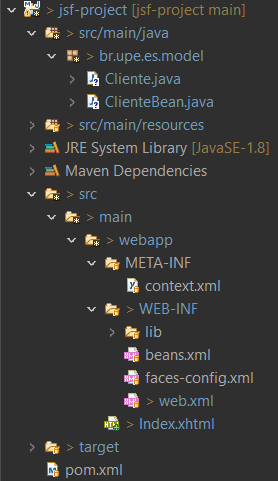
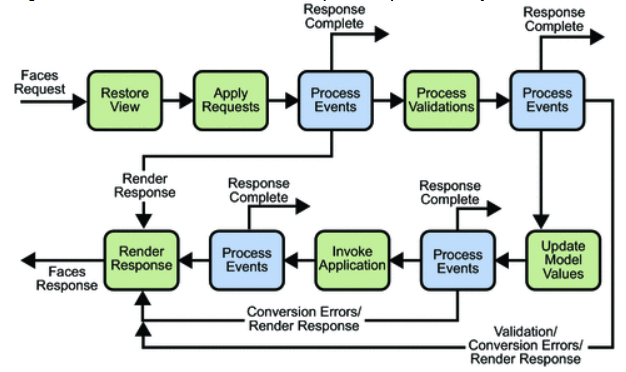

# Seminário de `JSF`

Este seminário técnico e aprofundado sobre `JSF` explora os fundamentos da arquitetura do `JSF`, destacando sua abordagem baseada em componentes e seu ciclo de vida de processamento de requisições.

# Seção 1: Introdução ao JSF

## 1.1 O que é JSF?

O `JSF` (Jakarta Faces, atualmente) foi desenvolvido pela Sun Microsystems (agora adquirida pela Oracle Corporation) como parte da plataforma Java EE (Enterprise Edition). No momento em que foi criado, sua função foi tentar resolver problemas como a complexidade de desenvolvimento, gerenciamento de estado, reusabilidade de componentes e integração com outras tecnologias Java. É importante destacar que este framework se baseia no padrão MVC, e que dentre suas principais características, é importante destacar o uso de componentes. Nele, já vem uma lista de componentes que podem ser utilizados, porém também podem ser usadas algumas bibliotecas que contêm mais componentes, como o PrimeFaces.

Apesar de ainda ser utilizado em  projetos específicos e mais ainda em sistemas legado, ele era mais utilizado até o meio da década de 2010, que foi justamente quando começou a perder espaço para frameworks mais modernos e progressivos, como `React.js`, `VUE`, entre outros.

Junto com o `Spring MVC` e `Struts`, ele é baseado em Java. Enquanto o `Spring` tem uma estrutura mais completa, contando com com as funcionalidades necessárias para atender requisições HTTP, delegar responsabilidades de processamento de dados para outros componentes e preparar a resposta que precisa ser dada, o `JSF` se baseia em um modelo um pouco mais complexo. Como será explicado depois, seu ciclo de vida conta com bem mais passos, que são, de certa forma, “mascarados” no `Spring MVC`. 

Enquanto o `Struts` é um framework MVC mais tradicional baseado em configuração XML e tags JSP, o `JSF` é um framework MVC baseado em componentes com uma abordagem mais moderna e orientada a eventos. A escolha entre `Struts` e `JSF` geralmente depende das preferências da equipe de desenvolvimento, dos requisitos do projeto e da infraestrutura tecnológica existente.

- Qual a diferença entre o `JSF` e um framework mais progressivo `React.js`?

Em relação a arquitetura, é importante destacar que, enquanto o `JSF` é baseado no MVC e componentizado e utiliza a renderização no lado do servidor, o React usa a renderização no lado do cliente, além de que o `JSF` gerencia o estado usando a sessão do servidor e a árvore de componentes, enquanto o React usa um DOM virtual e um fluxo de dados unidirecional para lidar com o gerenciamento de estado. O DOM virtual do React permite atualizações eficientes e melhor desempenho ao lidar com interações complexas de UI e mudanças de estado.

Além disso, o framework `JSF` é não reativo, ao contrário da maioria dos frameworks webs mais utilizados, enquanto frameworks reativos como o `VUE` atuam utilizando a assincronia, e tendo como base conceitos como a responsividade (A  capacidade de oferecer um feedback mais rápido), resiliência(A capacidade de reagir e se recuperar de falhas) e elasticidade(A capacidade de se manter responsivo e resiliente, mesmo com altas variações de carga). 

Dito isso, em relação à outros frameworks mais progressivos, e suas principais características, é importante destacar pontos cruciais como a curva de aprendizado: onde `JSF` tende a ter mais íngreme em comparação com React e Angular, especialmente para desenvolvedores que não estão familiarizados com o ecossistema Java EE, e a performance: onde em termos de performance, `JSF` pode ser considerado relativamente eficiente. No entanto, em comparação com React e Angular, `JSF` pode ser menos eficiente em termos de renderização de interfaces de usuário altamente dinâmicas e interativas.

## 1.2 Por que JSF?

O JavaServer Faces (JSF) ganhou popularidade principalmente devido à sua integração com o ecossistema Java EE e sua abordagem baseada em componentes para o desenvolvimento de interfaces de usuário web.

O `JSF` é ideal para aplicações empresariais devido à sua escalabilidade e integração com tecnologias Java EE como EJB e JPA, permitindo o desenvolvimento de sistemas robustos. Sua capacidade de gerenciamento de estado é vantajosa para sistemas corporativos complexos, e sua integração com APIs de segurança oferece um alto nível de proteção. Ele também é adequado para e-commerce devido aos seus componentes ricos de UI e facilidade de integração com sistemas de pagamento. Em resumo, o `JSF` é uma escolha popular para projetos que exigem uma UI complexa, requisitos de segurança elevados e escalabilidade.

É importante notar que o cenário de desenvolvimento web está em constante evolução, e outras tecnologias, como `Angular`, `React` e `Vue.js`, ganharam popularidade nos últimos anos. Dependendo dos requisitos do projeto, pode ser vantajoso considerar essas tecnologias alternativas ao JSF, principalmente devido a experiência do usuário e o desempenho.

### 1.2.1 **Comparação JSF, Vue e React**

- **Tamanho do Framework:**

**JSF:** Pode variar dependendo da implementação específica e das bibliotecas adicionais utilizadas em um projeto. No entanto, em termos de tamanho de arquivo para download, o próprio `JSF` é relativamente pequeno, geralmente medido em megabytes.

**Vue:** A versão completa do `Vue.js`, incluindo o runtime e todas as funcionalidades, tem cerca de 80KB, devido ao seu tamanho de biblioteca menor e modularidade.

**React:** É conhecido por ser leve, especialmente quando usado com abordagens como `React` com JSX e componentes funcionais. Sua biblioteca se aproxima muito do tamanho do `Vue.js`, com 100KB, o que ajuda em alta performance durante a execução.

- **Velocidade:**

**JSF:** Pode ser mais lento em termos de velocidade de carregamento e renderização, especialmente em comparação com `Vue` e `React`, devido à complexidade do ciclo de vida e à comunicação com o back-end.

**Vue:** É geralmente mais rápido devido à sua abordagem eficiente de renderização com Virtual DOM.

**React:** É conhecido por sua eficiência de renderização, especialmente devido ao seu Virtual DOM e algoritmo de reconciliação.

- **Flexibilidade:**

**JSF:** É altamente integrado ao ecossistema Java EE, o que pode limitar sua flexibilidade para projetos fora desse contexto.

**Vue:** Oferece mais flexibilidade, permitindo uma variedade de abordagens de desenvolvimento e fácil integração com outras bibliotecas JavaScript.

**React:** Se diferencia pela sua abordagem inovadora de construção de interfaces de usuário, que se baseia em um modelo de componente reutilizável e declarativo, oferecendo assim uma experiência de desenvolvimento altamente flexível e escalável.

- **Curva de aprendizado:**

**JSF:** Pode ser íngreme para iniciantes devido à sua complexidade e conceitos específicos do Java EE.

**Vue:** É conhecido por ter uma curva de aprendizado mais suave, especialmente para desenvolvedores que já estão familiarizados com HTML, CSS e JavaScript.

**React:** Pode ser moderada, especialmente para aqueles familiarizados com JavaScript e programação funcional.

- **Integração com AJAX:**

**JSF:** Possui suporte nativo para AJAX através do componente f:ajax, tornando a integração com chamadas assíncronas relativamente fácil.

**Vue:** Não possui uma solução nativa para chamadas AJAX, mas é frequentemente usado em conjunto com bibliotecas como Axios para lidar com requisições assíncronas.

**React:** Embora não tenha uma solução embutida para chamadas AJAX, o React oferece uma integração fluida com bibliotecas populares como Axios.

- **Suporte a Facelets:**

**JSF:** Possui suporte nativo para Facelets, uma tecnologia de templating poderosa e flexível, facilitando a criação de interfaces de usuário.

**Vue:** Não é integrado diretamente com Facelets, mas pode ser usado em conjunto com ele, onde oferece uma integração fluida, permitindo o desenvolvimento de interfaces de usuário interativas e responsivas.

**React:** Não possui uma integração direta com Facelets, mas pode ser facilmente usado em conjunto, especialmente em ambientes onde a separação entre front-end e back-end é uma prática comum.
  
## 1.3 Primeiros Passos com JSF

- **IDE Recomendada:** Eclipse IDE

- **Configurações Iniciais com Eclipse e Tomcat:** 

[](https://www.youtube.com/watch?v=769ZnyHNB8k)

- **Estrutura do projeto:** 



Em `src/main/java`, criamos um pacote onde podemos colocar a classe e seu respectivo bean juntos. Quanto à página HTML, ela deve ser colocada diretamente em `src/main/webapp`. Os arquivos XML de configuração são armazenados dentro de `src/main/webapp/WEB-INF`, assim como qualquer arquivo.jar adicional necessário para o projeto, que é colocado em `src/main/webapp/WEB-INF/lib`.

## 1.4 Primeiro Componente JSF

- **Classe Cliente.java:**

```xml
public class Cliente {
  private String nome;
  private int idade;
  private String genero;

  public Cliente() {}

  public String getNome() {
    return nome;
  }

  public void setNome(String nome) {
    this.nome = nome;
  }

  public int getIdade() {
    return idade;
  }

  public void setIdade(int idade) {
    this.idade = idade;
  }

  public String getGenero() {
    return genero;
  }

  public void setGenero(String genero) {
    this.genero = genero;
  }
}
```

- **Classe ClienteBean.java:**

```xml
import javax.faces.bean.ManagedBean;
import javax.faces.bean.SessionScoped;

@ManagedBean
@SessionScoped
public class ClienteBean {
  private Cliente cliente;

  public ClienteBean() {
    cliente = new Cliente();
  }

  public Cliente getCliente() {
    return cliente;
  }

  public void setCliente(Cliente cliente) {
    this.cliente = cliente;
  }

  public void adicionarCliente() {
    System.out.println("Cliente adicionado:");
    System.out.println("Nome: " + cliente.getNome());
    System.out.println("Idade: " + cliente.getIdade());
    System.out.println("Gênero: " + cliente.getGenero());
  }
}
```

- **Página Index.xhtml:**

```xml
<!DOCTYPE html>
<html xmlns="http://www.w3.org/1999/xhtml"
	xmlns:h="http://xmlns.jcp.org/jsf/html"
	xmlns:f="http://xmlns.jcp.org/jsf/core">

<h:head>
	<title>Adicionar Cliente</title>
</h:head>

<h:body>
	<h:form>
		<h:panelGrid columns="2">
			<h:outputLabel for="nome" value="Nome do Cliente: " />
			<h:inputText id="nome" value="#{clienteBean.cliente.nome}" />

			<h:outputLabel for="idade" value="Idade do Cliente: " />
			<h:inputText id="idade" value="#{clienteBean.cliente.idade}" />

			<h:outputLabel for="genero" value="Gênero do Cliente: " />
			<h:selectOneMenu id="genero" value="#{clienteBean.cliente.genero}">
				<f:selectItem itemValue="Masculino" itemLabel="Masculino" />
				<f:selectItem itemValue="Feminino" itemLabel="Feminino" />
				<f:selectItem itemValue="Outro" itemLabel="Outro" />
			</h:selectOneMenu>
		</h:panelGrid>

		<h:commandButton value="Adicionar Cliente"
			action="#{clienteBean.adicionarCliente}" />
		<h2>Dados do Cliente Adicionado:</h2>
		<h:panelGrid columns="2">
			<h:outputText value="Nome do Cliente: " />
			<h:outputText value="#{clienteBean.cliente.nome}" />

			<h:outputText value="Idade do Cliente: " />
			<h:outputText value="#{clienteBean.cliente.idade}" />

			<h:outputText value="Gênero do Cliente: " />
			<h:outputText value="#{clienteBean.cliente.genero}" />
		</h:panelGrid>
	</h:form>
</h:body>
</html>
```

Primeiro é criado o xhtml com o componente de `h:inputText` para receber o valor do nome e da idade do cliente.

Agora criamos a classe ClienteBean, que é um managed bean definido com a anotação @ManagedBean. Ele possui uma propriedade cliente do tipo Cliente, que representa os dados do cliente. Além disso, ele possui um método adicionarCliente() que será chamado quando o botão "Adicionar Cliente" for clicado. 

Então, quando são preenchidos os campos no formulário HTML e o botão "Adicionar Cliente" é clicado, o JSF atualiza as propriedades do managed bean ClienteBean com os valores inseridos pelo usuário. Em seguida, ele chama o método adicionarCliente() no bean ClienteBean, onde são processados os dados do cliente. O resultado é refletido no próprio XHTML, onde os valores são exibidos utilizando expressões (#{clienteBean.cliente.nome}; #{clienteBean.cliente.idade} e #{clienteBean.cliente.genero}).

Também adicionamos o componente `h:selectOneMenu` para a seleção do genêro do cliente.

O `h:commandButton` é um botão que, quando clicado, aciona a ação especificada no atributo action. No nosso caso, ele está chamando o método adicionarCliente() no bean ClienteBean.

E por fim, o `h:outputText` é um componente para exibir texto. Os valores mostrados aqui estão diretamente ligados às propriedades do managed bean ClienteBean.

# Seção 2: Arquitetura do JSF

## 2.1 Definição e Estrutura de Componentes do JSF

Em JavaServer Faces (JSF), os componentes são responsáveis por construírem as interfaces de usuário, e fazer com que sejam dinâmicas e interativas. Um componente no contexto do JSF é uma abstração de um elemento de interface do usuário (UI) que encapsula seu comportamento, lógica e estado. 

Para gerenciar o estado e a lógica de negócios dos componentes de UI, JSF utiliza Managed Beans e backing beans. Managed Beans são classes Java que atuam como objetos de suporte para os componentes de UI em uma aplicação JSF. Essas classes são gerenciadas pelo container JSF e são responsáveis por lidar com o estado e a lógica de negócios associados aos componentes. Elas encapsulam a lógica da aplicação e oferecem métodos e propriedades que podem ser acessados diretamente pelas páginas JSF. Geralmente, os Managed Beans são anotados com @ManagedBean para indicar ao JSF que eles devem ser gerenciados pelo container. 

Já os backing beans são um tipo específico de Managed Beans que são usados para suportar a interface de usuário (UI) em páginas JSF. Eles são responsáveis por manter o estado dos componentes de UI e executar a lógica de negócios associada às interações do usuário. Os backing beans geralmente são associados a formulários ou páginas específicas e são utilizados para vincular os valores dos componentes de UI aos campos de dados do modelo de negócios. Eles podem conter métodos que são chamados em resposta a eventos de UI, como submissão de formulário ou cliques em botões.

Managed Beans e backing beans fornecem um meio de gerenciar o estado e a lógica de negócios dos componentes de UI. Eles ajudam a manter a separação de interesses entre a camada de apresentação e a camada de lógica de negócios, o que contribui para a modularidade, reutilização e manutenção do código da aplicação.

**Definição de Componente:** No contexto do JavaServer Faces (JSF), um componente é uma abstração de um elemento de interface do usuário (UI) que encapsula seu próprio comportamento, lógica e estado. Os componentes são a base para construir a interface do usuário em uma aplicação JSF. Eles podem variar desde simples, como campos de entrada de texto e botões, até complexos, como tabelas de dados e painéis de abas.

Os componentes em JSF seguem uma hierarquia, onde alguns componentes podem conter outros. Por exemplo, um formulário (<h:form>) pode conter vários campos de entrada (<h:inputText>) e botões de comando (<h:commandButton>). Essa hierarquia facilita a organização e a composição de interfaces de usuário complexas.

Os componentes são definidos em páginas XHTML usando tags específicas do JSF. Por exemplo, para criar um campo de entrada de texto, podemos usar a tag <h:inputText>, e para um botão de comando, usamos <h:commandButton>. Os atributos dessas tags podem ser configurados para controlar o comportamento e a aparência dos componentes.

**Composição de Componentes:** Os componentes em JSF podem ser aninhados e compostos uns com os outros para criar interfaces de usuário complexas e ricas em funcionalidades. Isso significa que podemos agrupar componentes menores para criar componentes maiores e mais complexos.

A composição de componentes permite a reutilização eficiente de código, pois pequenos componentes podem ser usados em várias partes da aplicação. Além disso, os dados podem ser passados entre os componentes usando Expressions Language (EL) e Taglibs. Por exemplo, o valor de um campo de entrada pode ser vinculado a uma propriedade em um backing bean usando EL, permitindo que os dados sejam recuperados e processados posteriormente.

**Exemplo Prático:** 

```xml
<!DOCTYPE html>
<html xmlns="http://www.w3.org/1999/xhtml"
      xmlns:h="http://xmlns.jcp.org/jsf/html">
<h:head>
    <title>Formulário JSF</title>
</h:head>
<h:body>
    <h:form>
        <h:outputLabel for="nome" value="Nome:" />
        <h:inputText id="nome" value="#{formularioBean.nome}" />
        <br/>
        <h:commandButton value="Enviar" action="#{formularioBean.enviar}" />
    </h:form>
</h:body>
</html>
```

```xml
package upe.br.es;

import javax.faces.bean.ManagedBean;
import javax.faces.bean.RequestScoped;

@ManagedBean
@RequestScoped
public class FormularioBean {
    private String nome;

    public String getNome() {
        return nome;
    }

    public void setNome(String nome) {
        this.nome = nome;
    }

    public String enviar() {
        return "resultado";
    }
}
```

## 2.2 Sistema Reativo do JSF (Ciclo de Vida de uma Página no JSF)

Ao contrário do conceito de reatividade em frameworks como Vue.js, onde as atualizações são automaticamente refletidas na interface do usuário quando os dados subjacentes mudam, no JavaServer Faces (JSF), a reatividade é gerenciada pelo ciclo de vida da aplicação. Isso significa que as atualizações na interface do usuário ocorrem em resposta aos eventos do ciclo de vida da página, como processamento de eventos de UI, validações e atualizações do modelo, que acontecem antes da renderização da resposta na página.

- O ciclo de vida da página JSF se comporta dessa maneira:

  

  - **Restauração da View:** Nesta fase, o JSF verifica se a requisição do usuário está associada a uma visualização JSF existente ou se é necessário criar uma nova. Os desenvolvedores podem intervir nesta fase adicionando ou modificando componentes da visualização, como campos de entrada, botões, etc.

  - **Aplicação de Validações de Componentes:** Durante esta fase, o JSF valida os dados de entrada do usuário com base nas regras de validação definidas pelos desenvolvedores nos componentes da interface do usuário. Os desenvolvedores podem intervir nesta fase personalizando as mensagens de erro ou adicionando suas próprias regras de validação.

  - **Processamento de Eventos do Componente:** Aqui, os eventos gerados pelos componentes da interface do usuário são processados. Os desenvolvedores podem intervir nesta fase implementando métodos de ação para lidar com os eventos dos componentes. Eles podem executar operações adicionais, como chamar métodos de negócios ou atualizar o modelo de dados.

  - **Atualização do Modelo:** Após a validação dos dados e o processamento dos eventos, o modelo de dados da aplicação é atualizado para refletir as alterações feitas pelo usuário. Os desenvolvedores podem intervir nesta fase atualizando manualmente o modelo de dados ou executando operações adicionais antes que a resposta seja renderizada.

  - **Renderização da Resposta:** Finalmente, nesta fase, o JSF gera o HTML correspondente à resposta da requisição do usuário, que será enviada de volta ao navegador para exibição. Os desenvolvedores podem intervir nesta fase personalizando a aparência da resposta, definindo templates de visualização, aplicando estilos CSS e muito mais.

O JSF realiza o tráfego de dados entre o cliente e o servidor usando o protocolo HTTP. Quando os dados são alterados pelo usuário, eles são enviados ao servidor por meio de solicitações HTTP, onde são processados pelo ciclo de vida da página JSF. As alterações no modelo de dados durante o processamento da página são refletidas na resposta enviada de volta ao navegador do usuário.

Para atualizar partes da página dinamicamente sem recarregar toda a página, o JSF oferece suporte a AJAX (Asynchronous JavaScript and XML). Com AJAX, os desenvolvedores podem enviar solicitações assíncronas ao servidor para buscar ou atualizar dados específicos sem a necessidade de recarregar a página inteira. Isso melhora significativamente a experiência do usuário, especialmente em casos onde pequenas atualizações são necessárias, evitando a recarga desnecessária de recursos.
  
## 2.3 Comunicação Entre Componentes
A comunicação entre componentes em JSF é facilitada pelo uso de Expression Language (EL), que permite o acesso e a manipulação dos dados dos Managed Beans nos componentes de UI. A EL é uma linguagem de script utilizada para referenciar objetos em tempo de execução, permitindo uma integração fácil e direta entre a camada de apresentação (UI) e a camada de negócios.

No JSF, os componentes comunicam-se diretamente com os Managed Beans através de bindings. Isso significa que os atributos e métodos dos Managed Beans podem ser vinculados aos componentes de UI usando EL. Por exemplo, um campo de entrada (input) pode ser associado a uma propriedade de um Managed Bean, e quando o valor do campo é alterado, essa mudança é refletida automaticamente no Managed Bean e vice-versa.

Os eventos são fundamentais para a interação dinâmica dentro de uma aplicação JSF. Os componentes JSF podem gerar eventos em resposta a ações do usuário, como cliques de botões ou alterações de valores em campos de entrada. Por sua vez, esses eventos são tratados por listeners, que são métodos ou classes Java responsáveis por processar as ações associadas aos eventos.

Por exemplo, ao clicar em um botão de "Salvar", um evento é gerado, e um listener associado a esse evento pode ser chamado para executar a lógica de salvamento dos dados no banco de dados.

No JSF, os escopos referem-se aos diferentes níveis de vida útil dos objetos gerenciados (Managed Beans). Existem diversos escopos disponíveis no JSF, cada um indicando por quanto tempo um Managed Bean deve ser mantido e disponível durante o ciclo de vida da requisição. Alguns dos escopos mais comuns são:

- **Request Scope:** O Managed Bean é criado para atender a uma única requisição do usuário e é descartado após a resposta ser enviada de volta ao cliente.
- **Session Scope:** O Managed Bean é mantido para toda a sessão do usuário.
- **Application Scope:** O Managed Bean é mantido enquanto a aplicação estiver em execução.

As anotações utilizadas para definir esses escopos são `@RequestScoped`, `@SessionScoped`, e `@ApplicationScoped`, respectivamente.

O JSF facilita a comunicação entre componentes na mesma página ou entre páginas diferentes através de diversos mecanismos, como:

Como mencionado anteriormente, os componentes podem se comunicar diretamente com os Managed Beans usando EL e bindings.
Os eventos e listeners permitem que os componentes gerem e respondam a ações do usuário de forma dinâmica.
O contexto de aplicação do JSF permite que os dados sejam compartilhados entre diferentes partes da aplicação, possibilitando uma comunicação eficiente entre componentes em diferentes partes da mesma página ou em páginas diferentes.

# Seção 3: Padrões de Projeto e Implementação Avançada no JSF

## 3.1 Padrões de Projeto no JSF

O JavaServer Faces (JSF) incorpora vários padrões de projeto fundamentais que facilitam o desenvolvimento de aplicações robustas e manuteníveis.

- **Modelo MVC (Model-View-Controller):**
O padrão Modelo-Visão-Controlador é central no JSF. Ele promove a separação de preocupações entre os dados (Modelo), a apresentação (Visão) e a lógica de controle (Controlador). No JSF, os componentes visuais (View) são definidos nos arquivos de facelets, enquanto a lógica de controle é implementada nos Managed Beans, que atuam como controladores. Os dados são manipulados pelos modelos subjacentes, muitas vezes representados por entidades JavaBeans.

- **Injeção de Dependência:**
JSF favorece o princípio de Injeção de Dependência (DI), facilitando a criação de componentes e a resolução de dependências de forma transparente. Por meio do CDI (Contexts and Dependency Injection), o JSF permite injetar automaticamente instâncias de beans gerenciados em outras classes, reduzindo a acoplamento e simplificando a configuração de componentes.

- **Front Controller:**
O padrão Front Controller é implementado no JSF através do FacesServlet. O FacesServlet atua como o controlador central da aplicação, roteando todas as solicitações para os devidos componentes de processamento. Isso simplifica o fluxo de controle e permite a centralização da lógica de navegação e manipulação de solicitações.

- **Outros Padrões Utilizados:**
Além dos padrões mencionados acima, o JSF incorpora uma série de outros padrões de design para resolver problemas comuns de desenvolvimento web. Alguns desses padrões incluem:

  - **Template Method:** Utilizado na definição de componentes reutilizáveis e personalizáveis.
  - **Observer:** Empregado em eventos de ciclo de vida do JSF para notificar componentes registrados sobre alterações de estado.
  - **Composite:** Usado na criação de componentes compostos que encapsulam funcionalidades complexas.

- **Técnicas Avançadas de Implementação:**
Além dos padrões de projeto, existem várias técnicas avançadas de implementação que podem otimizar a eficiência e a escalabilidade dos projetos JSF:

  - **Lazy Loading:** Carregar dados sob demanda para melhorar o desempenho e reduzir a sobrecarga inicial.
  - **Cache:** Armazenar em cache dados estáticos ou frequentemente acessados para reduzir a carga no servidor.
  - **CDI Escopo:** Utilizar escopos adequados de CDI para gerenciar o ciclo de vida dos beans e otimizar o uso de recursos.

  - Essas técnicas, combinadas com os padrões de projeto mencionados anteriormente, ajudam a criar aplicações JSF eficientes e escaláveis, capazes de lidar com os desafios do desenvolvimento web moderno.

### 3.1.1 Padrão Front Controller

- **Importância no JSF:**
O padrão Front Controller é essencial no JavaServer Faces (JSF) porque coordena todas as solicitações para a aplicação web através de um único ponto de entrada, o FacesServlet. Isso promove a centralização do controle e da lógica de navegação, simplificando o desenvolvimento e a manutenção da aplicação.

- **Explicação do Padrão:**
O Front Controller é um padrão de design que fornece um controlador centralizado para lidar com todas as solicitações recebidas por uma aplicação web. No contexto do JSF, o FacesServlet atua como o Front Controller. Quando uma solicitação é feita para uma aplicação JSF, ela é direcionada para o FacesServlet, que gerencia o ciclo de vida das requisições JSF e coordena a navegação entre as páginas.

- **Funcionamento do FacesServlet como Front Controller:**
O FacesServlet é responsável por processar todas as solicitações JSF e roteá-las para os componentes apropriados. Ele gerencia o ciclo de vida das requisições JSF, incluindo a fase de aplicação, onde os eventos são processados e a resposta é gerada. Além disso, o FacesServlet é responsável por controlar a navegação entre as páginas, determinando para qual página o usuário deve ser redirecionado após uma ação ser executada.

- Como configurar o web.xml para definir o FacesServlet e como definir regras de navegação no faces-config.xml:

```xml
<!-- Configuração do web.xml -->
<servlet>
    <servlet-name>Faces Servlet</servlet-name>
    <servlet-class>javax.faces.webapp.FacesServlet</servlet-class>
    <load-on-startup>1</load-on-startup>
</servlet>

<servlet-mapping>
    <servlet-name>Faces Servlet</servlet-name>
    <url-pattern>*.jsf</url-pattern>
</servlet-mapping>
```

No arquivo web.xml, configuramos o FacesServlet e mapeamos suas URLs. Isso direcionará todas as solicitações que correspondem ao padrão *.jsf para o FacesServlet.

```xml
<!-- Definição de Regras de Navegação no faces-config.xml -->
<navigation-rule>
    <from-view-id>/pagina1.xhtml</from-view-id>
    <navigation-case>
        <from-outcome>pagina2</from-outcome>
        <to-view-id>/pagina2.xhtml</to-view-id>
    </navigation-case>
    <navigation-case>
        <from-outcome>pagina3</from-outcome>
        <to-view-id>/pagina3.xhtml</to-view-id>
    </navigation-case>
</navigation-rule>
```

No arquivo faces-config.xml, definimos regras de navegação para direcionar o usuário para diferentes páginas com base nas ações executadas. Por exemplo, se o usuário estiver na página1.xhtml e uma ação resultar em "pagina2", ele será redirecionado para pagina2.xhtml.

## 4 Técnicas Avançadas de Implementação

### 4.1 Uso de AJAX no JSF

AJAX é uma técnica utilizada no desenvolvimento web para atualizar partes específicas de uma página sem a necessidade de recarregar a página inteira e é frequentemente utilizado no contexto do JSF para melhorar a experiência do usuário, permitindo interações mais dinâmicas e responsivas.

No JSF, você pode usar a tag `f:ajax` para adicionar comportamentos AJAX a componentes JSF, como botões, links e inputs. Essa tag permite definir quais eventos devem acionar a requisição AJAX, quais componentes devem ser processados no lado do servidor e quais componentes da página devem ser atualizados após a resposta do servidor.

- O atributo execute especifica quais componentes JSF devem ser processados no lado do servidor antes de enviar a requisição AJAX. No exemplo fornecido `execute="@form"`, todos os componentes dentro do formulário atual serão processados.

- O atributo render especifica quais componentes da página devem ser atualizados após a resposta do servidor. No exemplo fornecido `render="@form"`, o formulário atual será atualizado.

```xml
  <h:form>
  <h:inputText value="#{bean.valorEntrada}" />
  <h:commandButton value="Enviar" action="#{bean.submeter}">
    <f:ajax execute="@form" render="@form" />
  </h:commandButton>
  </h:form>
```

```xml
@ManagedBean
@RequestScoped
public class Bean {
    
    private String valorEntrada;
    
    
    public String getValorEntrada() {
        return valorEntrada;
    }

    public void setValorEntrada(String valorEntrada) {
        this.valorEntrada = valorEntrada;
    }
    
    public void submeter() {
        System.out.println("Valor de entrada: " + valorEntrada);
    }
}
```

### 4.2 Templates Facelets

Os Templates Facelets no JSF permitem criar layouts reutilizáveis que podem ser aplicados em várias páginas da aplicação, facilitando a manutenção e a consistência do design. Eles funcionam definindo um template base que inclui elementos comuns da UI, como cabeçalho, rodapé e menu de navegação.

Os templates Facelets promovem a reutilização de código e a separação clara entre layout e conteúdo. Isso é alcançado através do uso de tags específicas, como `ui:define`, `ui:include`, ou `ui:composition`, que permitem inserir conteúdo específico nas páginas que utilizam o template, enquanto reutilizam a estrutura comum.

```xml
<!-- template.xhtml -->
<!DOCTYPE html>
<html xmlns="http://www.w3.org/1999/xhtml"
      xmlns:h="http://xmlns.jcp.org/jsf/html"
      xmlns:ui="http://xmlns.jcp.org/jsf/facelets">
<head>
    <title><ui:insert name="title">Título</ui:insert></title>
</head>
<body>
    <header>
        <h1>Aplicativo</h1>
        <ui:insert name="header"></ui:insert>
    </header>

    <nav>
        <ul>
            <li><a href="#">Página 1</a></li>
            <li><a href="#">Página 2</a></li>
            <li><a href="#">Página 3</a></li>
        </ul>
    </nav>

    <main>
        <ui:insert name="content"></ui:insert>
    </main>

    <footer>
        <p>Rodapé</p>
        <ui:insert name="footer"></ui:insert>
    </footer>
</body>
</html>
```

```xml
<!-- minhaPagina.xhtml -->
<ui:composition template="/template.xhtml"
                xmlns="http://www.w3.org/1999/xhtml"
                xmlns:h="http://xmlns.jcp.org/jsf/html"
                xmlns:ui="http://xmlns.jcp.org/jsf/facelets">

    <ui:define name="title">Meus Produtos</ui:define>
    
    <ui:define name="content">
        <h2>Bem-vindo à Página de Produtos</h2>
        <p>Aqui você encontrará uma lista de produtos disponíveis:</p>
        <ul>
            <li>Produto 1</li>
            <li>Produto 2</li>
            <li>Produto 3</li>
        </ul>
    </ui:define>
</ui:composition>
```

Neste exemplo, `template.xhtml` define a estrutura comum da aplicação, incluindo o cabeçalho, menu de navegação, conteúdo e rodapé. `minhaPagina.xhtml` utiliza este template, inserindo seu próprio conteúdo específico na área definida por `ui:define name="content"`. Isso permite que a estrutura do layout seja reutilizada em várias páginas, enquanto o conteúdo específico de cada página é inserido conforme necessário.

## 5 Conclusão e Reflexão

- **Preparem uma Demonstração**: Certifiquem-se de que o projeto final esteja totalmente funcional e pronto para ser demonstrado. Revisem todos os requisitos do projeto para garantir que nada foi esquecido.

- **Organizem a Apresentação**: Criem uma sequência lógica para apresentar o projeto. Iniciem com uma visão geral da aplicação, seguida por uma demonstração das funcionalidades principais e dos aspectos técnicos destacados.

- **Aproveitem para Destacar Desafios e Soluções**: Identifiquem os principais desafios enfrentados durante o desenvolvimento do projeto e discutam como resolveram esses problemas. Isso pode incluir desafios de codificação, decisões de design ou a integração de tecnologias.

- **Screencasts ou Vídeos** : Considerem a utilização de screencasts para demonstrar a funcionalidade da aplicação ou vídeos para explicar conceitos complexos. Isso pode ajudar a tornar a apresentação mais dinâmica e compreensível.
  
- **Discutam as Lições Aprendidas**: Reflitam sobre o que aprenderam durante o processo de desenvolvimento do projeto. Isso pode incluir novas habilidades técnicas, insights sobre design de software ou aperfeiçoamento de habilidades de trabalho em equipe.

- **Avaliem o Uso do JSF**: Avaliem como o JSF facilitou ou complicou o desenvolvimento do projeto. Discutam os pontos fortes e fracos com base na experiência prática adquirida.

- **Considerem Melhorias Futuras** : Pensem em como o projeto pode ser expandido ou melhorado. Discutam funcionalidades adicionais que poderiam ser implementadas ou como a arquitetura poderia ser otimizada para maior eficiência e escalabilidade.

- **Compartilhem Recursos Úteis**: Finalizem a apresentação compartilhando recursos que foram particularmente úteis durante o desenvolvimento do projeto. Isso pode incluir documentação, tutoriais, bibliotecas ou ferramentas.